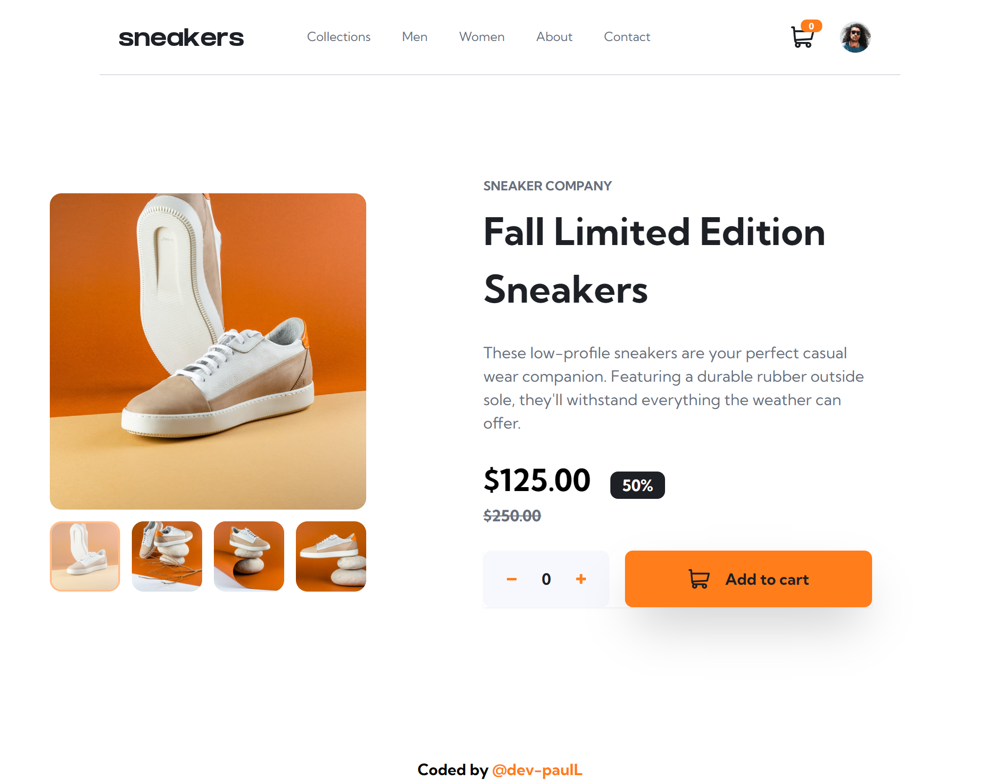
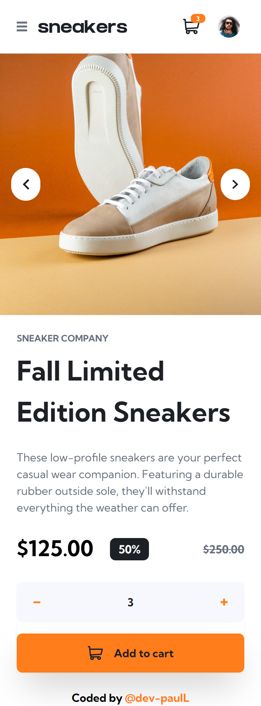
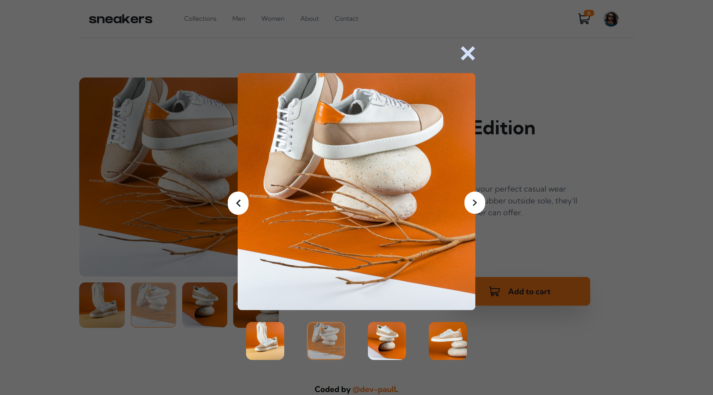

# Frontend Mentor - E-commerce product page solution

This is a solution to the [E-commerce product page challenge on Frontend Mentor](https://www.frontendmentor.io/challenges/ecommerce-product-page-UPsZ9MJp6). Frontend Mentor challenges help you improve your coding skills by building realistic projects.

## Overview

To run locally, clone this repo and run `npm install` then `npm run dev`.
### The challenge

Users should be able to:

- View the optimal layout for the site depending on their device's screen size
- See hover states for all interactive elements on the page
- Open a lightbox gallery by clicking on the large product image
- Switch the large product image by clicking on the small thumbnail images
- Add items to the cart
- View the cart and remove items from it

### Screenshot

Desktop

Mobile

Desktop Lightbox

### Links

- Solution URL: [Add solution URL here](https://your-solution-url.com)
- Live Site URL: [https://dev-paull.github.io/ecommerce-sneakers-page/](https://dev-paull.github.io/ecommerce-sneakers-page/)

## My process

I chose this challenge as my third React project to practice what I learned from my previous one (desserts with cart). I'm also practicing TailwindCSS. I am proud to have completed it without using Google, inspired by my last challenge cart logic. I improvised.

- 📊 Analyzed the screenshots and requirements to make sure the user could perform all specified actions.
- 🎨 Imported the necessary fonts and colors
- 🛠️ Created the base structure of the page
- 🛒 Added the cart (functionalities and style).
- 📱💻 Styled the product page for both mobile and desktop.
- 📂 Implemented the Mobile Menu and the gallery lightbox.
- ♻️ Refactored my code into reusable components, and I plan to keep improving it.
- ✨ **Hover effects and animations coming soon** 

### Built with

- React
- Vite
- Tailwind

